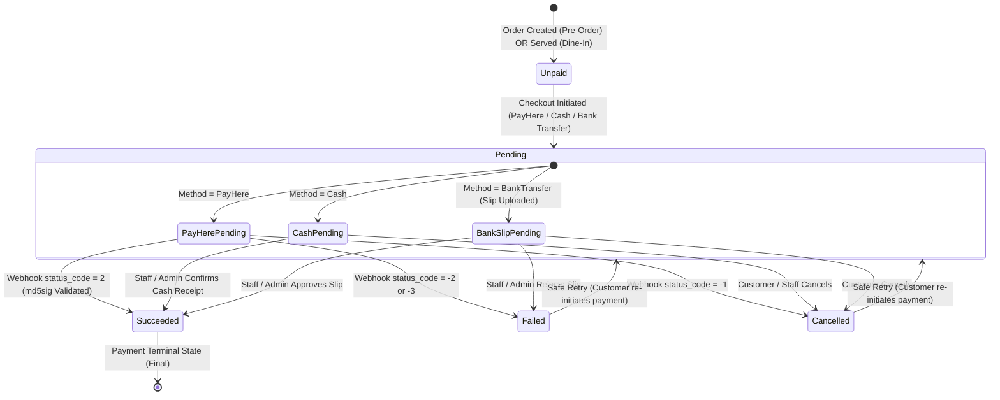
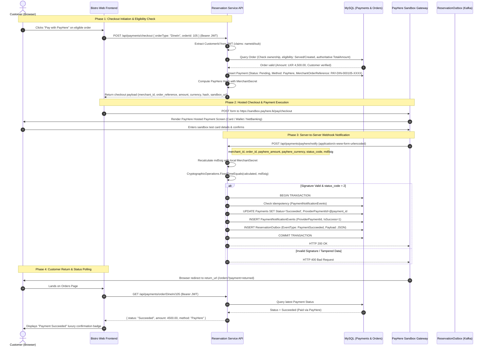
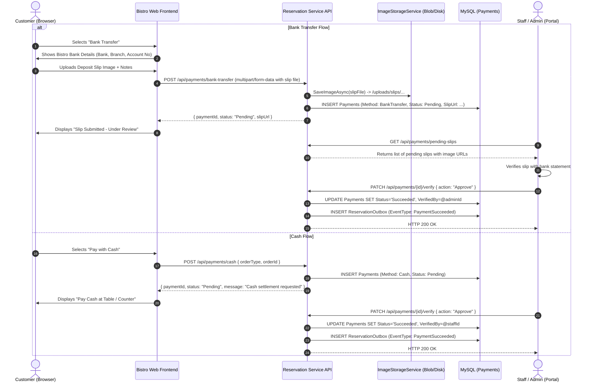

# SR-280 / SR-281: Payment Technical Contract and Architecture Specification

## 1. Overview & Scope

This specification defines the payment integration architecture for the **Cinnamon Bistro Smart Restaurant Management System** under Epic **SR-5 (Billing, Invoicing & Payments)**, Sprint 4 (Jira Story **SR-280**).

The primary gateway integration uses **PayHere Sandbox** for card, digital wallet, and online banking settlements. To provide flexibility for dining guests, the system additionally supports **Cash Settlement** (in-person table/counter payment) and **Bank Transfer** (direct bank deposit with payment slip image upload).

All payment operations reside in the **Reservation Service** and its database (`restaurant_reservation_db`). No separate microservice or dedicated Azure Container App is introduced.

---

## 2. Core Payment Contract & Decisions

| Parameter | Specification | Notes |
| :--- | :--- | :--- |
| **Supported Currency** | `LKR` (Sri Lankan Rupee) | Standard for Sprint 4. |
| **Payment Owner** | `reservation-service` | Responsible for checkout initiation, webhook processing, slip management, and state recording. |
| **Gateway Sandbox Action URL** | `https://sandbox.payhere.lk/pay/checkout` | PayHere Sandbox hosted checkout endpoint. |
| **Server Callback (`notify_url`)** | `/reservation-api/payments/payhere/notify` | Server-to-server callback (`POST application/x-www-form-urlencoded`). |
| **Customer Return Destination (`return_url`)** | `/orders?payment=returned` | Browser redirection only. **Never confirms payment.** |
| **Customer Cancel Destination (`cancel_url`)** | `/orders?payment=cancelled` | Browser redirection on customer abandonment. |
| **Payment Lifecycle States** | `Pending`, `Succeeded`, `Failed`, `Cancelled` | Stored in `Payments.Status`. Decoupled from kitchen & order lifecycle. |
| **Payable Order Eligibility** | **Reservation Pre-Orders:** Payable immediately upon valid creation (non-cancelled). **Dine-In Orders:** Payable **only after reaching the `Served` state**. | Enforced authoritatively by backend business logic. |
| **Authoritative Pricing** | Database `TotalAmount` | The payable amount is calculated server-side from active `MenuItems`. Client-supplied amounts are strictly rejected. |

---

## 3. Supported Payment Methods

1. **PayHere Sandbox (Online Checkout):**
   * Customer initiates checkout $\rightarrow$ backend calculates amount and generates security hash $\rightarrow$ customer submits to PayHere hosted checkout $\rightarrow$ PayHere notifies backend via `notify_url` $\rightarrow$ signature verified $\rightarrow$ payment marked `Succeeded`.
2. **Cash Settlement:**
   * Customer requests cash payment $\rightarrow$ payment record created with `PaymentMethod = 'Cash'`, `Status = 'Pending'` $\rightarrow$ restaurant staff/admin collects cash and confirms payment via `PATCH /api/payments/{id}/verify` $\rightarrow$ payment marked `Succeeded`.
3. **Bank Transfer (Slip Upload):**
   * Customer selects bank transfer $\rightarrow$ Cinnamon Bistro bank account details presented $\rightarrow$ customer uploads transfer/deposit slip image $\rightarrow$ backend stores slip securely via `IImageStorageService` $\rightarrow$ payment record created with `PaymentMethod = 'BankTransfer'`, `SlipUrl`, `Status = 'Pending'` $\rightarrow$ restaurant staff/admin inspects slip image and confirms payment via `PATCH /api/payments/{id}/verify` $\rightarrow$ payment marked `Succeeded` (or `Failed` if rejected).

---

## 4. Cryptographic Security & PayHere Signature Verification

### 4.1. PayHere Checkout Hash (Client-to-Gateway Form Submission)
To prevent tampering with transaction details when the browser redirects to PayHere:

$$\text{hash} = \text{strtoupper}(\text{md5}(\text{merchant\_id} + \text{order\_id} + \text{amount\_formatted} + \text{currency} + \text{strtoupper}(\text{md5}(\text{merchant\_secret}))))$$

* `amount_formatted` is formatted strictly with two decimal digits (e.g., `1500.00`).
* `merchant_secret` is held strictly in backend secure configuration (or Azure Container App secret reference). **Never exposed to frontend or Git.**

### 4.2. PayHere Webhook Verification (`notify_url`)
When PayHere posts notification data to the server callback:

$$\text{md5sig} = \text{strtoupper}(\text{md5}(\text{merchant\_id} + \text{order\_id} + \text{payhere\_amount} + \text{payhere\_currency} + \text{status\_code} + \text{strtoupper}(\text{md5}(\text{merchant\_secret}))))$$

* **Comparison Requirement:** Constant-time comparison using `CryptographicOperations.FixedTimeEquals` to guard against timing attacks.
* If signatures do not match, the notification is rejected immediately with HTTP 400 Bad Request.

### 4.3. PayHere Status Code Mapping

| PayHere `status_code` | Description | Internal `Payments.Status` |
| :---: | :--- | :--- |
| **`2`** | Success / Approved | `Succeeded` |
| **`0`** | Pending | `Pending` |
| **`-1`** | Canceled by User | `Cancelled` |
| **`-2`** | Failed / Declined | `Failed` |
| **`-3`** | Chargedback | `Failed` |

---

## 5. Idempotency & Webhook Resilience

1. **Duplicate Notification Protection:**
   * PayHere may retransmit notifications.
   * Table `PaymentNotificationEvents` records each processed `(Provider, ProviderPaymentId)`.
   * If a notification with the same `ProviderPaymentId` arrives:
     * Check if already recorded. If already processed, acknowledge with HTTP 200 OK without re-executing state transitions or duplicate Outbox writes.
2. **Transaction Isolation:**
   * The update to `Payments` and the insert into `PaymentNotificationEvents` and `ReservationOutbox` execute within a single MySQL database transaction.
3. **Browser Redirection Rule:**
   * The `return_url` navigates the customer back to the bistro web app. **It NEVER changes payment status to `Succeeded`.**
   * After returning, the frontend calls `GET /api/payments/order/{orderType}/{orderId}` to verify the backend status verified by the server callback.

---

## 6. Payment State Machine Diagram

---

## 7. End-to-End Sequence Diagram (PayHere Online Flow)

---

## 8. Bank Transfer & Cash Workflow Sequence

---

## 9. Sensitive Data & Audit Hygiene

* **Card Data Zero-Retention:** Complete card numbers, expiry dates, CVVs, or gateway secrets are never received, accepted, logged, or stored by the Reservation Service.
* **Log Sanitization:** All loggers output sanitized identifiers only (`CustomerId`, `OrderId`, `PaymentId`, `MerchantOrderReference`, `Status`, `Amount`, `Currency`). Webhook request bodies, JWTs, and database connection strings are never emitted in plain text.
* **Audit Trail:** Every payment initiation, status transition, webhook receipt, slip submission, and staff verification generates a structured, immutable outbox event and operational audit entry.
